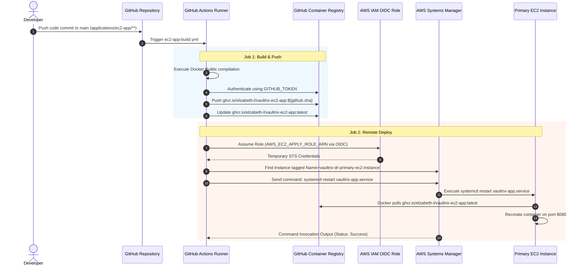

# 02. Container Build & GHCR Workflow — Comprehensive Notes

## 1. Container Architecture Overview

The EC2 application uses a Docker container built from `applications/ec2-app/Dockerfile`. Containerization ensures that identical runtime binaries are executed across both Primary (`ap-south-1`) and DR (`ap-southeast-1`) environments without OS-level drift.

```
  +-------------------------------------------------------------------------+
  |                           DOCKER CONTAINER STACK                        |
  +-------------------------------------------------------------------------+
  | Base Image: python:3.12-slim                                            |
  | OS Packages: curl, libpq-dev, gcc                                       |
  | Non-Root Security User: appuser (UID 1000)                               |
  | Application Code: /app/                                                 |
  | Listener Port: EXPOSE 8080                                              |
  | Process Manager: Gunicorn (2 Workers, 4 Threads) -> Flask (app:app)     |
  | Image Tagging: ghcr.io/elzabeth-l/vaultrix-ec2-app:<sha> / :latest       |
  +-------------------------------------------------------------------------+
```

---

## 2. Deep Dive: `Dockerfile` Specification

```dockerfile
FROM python:3.12-slim

# Set environment variables
ENV PYTHONUNBUFFERED=1 \
    PYTHONDONTWRITEBYTECODE=1 \
    PORT=8080 \
    APP_ENV=PRIMARY

# Install system dependencies
RUN apt-get update && apt-get install -y --no-install-recommends \
    curl \
    libpq-dev \
    gcc \
    && rm -rf /var/lib/apt/lists/*

# Create non-root user
RUN useradd -m -u 1000 appuser

WORKDIR /app

# Install Python dependencies
COPY requirements.txt .
RUN pip install --no-cache-dir -r requirements.txt

# Copy application source code
COPY --chown=appuser:appuser . .

# Switch to non-root user
USER appuser

EXPOSE 8080

# Healthcheck targeting ALB health endpoint
HEALTHCHECK --interval=30s --timeout=5s --start-period=5s --retries=3 \
    CMD curl -f http://localhost:8080/health || exit 1

# Start Gunicorn server listening on 0.0.0.0:8080
CMD ["gunicorn", "--bind", "0.0.0.0:8080", "--workers", "2", "--threads", "4", "--access-logfile", "-", "--error-logfile", "-", "app:app"]
```

### Key Security & Optimization Principles
1. **Unprivileged Security Context (`USER appuser`)**: The container process runs under non-root account `appuser` (UID 1000) to prevent privilege escalation vulnerabilities on the underlying EC2 host.
2. **Minimal Layer Footprint**: Combines `apt-get update`, installation, and `rm -rf /var/lib/apt/lists/*` into a single `RUN` layer to reduce overall image size.
3. **Optimized Python Environment**: `PYTHONUNBUFFERED=1` ensures standard output and standard error logs stream directly to systemd `journalctl` without buffering. `PYTHONDONTWRITEBYTECODE=1` prevents redundant `.pyc` creation.

---

## 3. Deep Dive: GitHub Actions Workflow (`.github/workflows/ec2-app-build.yml`)

The workflow manages container compilation, publishing to GitHub Container Registry (GHCR), and automatic deployment restart on the active Primary EC2 instance.

```yaml
name: Primary 4 - EC2 application

on:
  push:
    branches:
      - main
    paths:
      - 'applications/ec2-app/**'
      - '.github/workflows/ec2-app-build.yml'
  pull_request:
    branches:
      - main
    paths:
      - 'applications/ec2-app/**'
      - '.github/workflows/ec2-app-build.yml'
  workflow_dispatch:

permissions:
  contents: read
  packages: write

env:
  REGISTRY: ghcr.io
  IMAGE_NAME: elzabeth-l/vaultrix-ec2-app
  AWS_REGION: ap-south-1
```

---

### Job 1: Build & Push Docker Image to GHCR (`build-and-push`)

```yaml
jobs:
  build-and-push:
    name: Build & Push Docker Image to GHCR
    runs-on: ubuntu-latest

    steps:
      - name: Checkout repository
        uses: actions/checkout@v4

      - name: Set up Docker Buildx
        uses: docker/setup-buildx-action@v3

      - name: Log in to GitHub Container Registry (GHCR)
        if: github.ref == 'refs/heads/main'
        uses: docker/login-action@v3
        with:
          registry: ${{ env.REGISTRY }}
          username: ${{ github.actor }}
          password: ${{ secrets.GITHUB_TOKEN }}

      - name: Build and push Docker image
        uses: docker/build-push-action@v6
        with:
          context: ./applications/ec2-app
          file: ./applications/ec2-app/Dockerfile
          push: ${{ github.ref == 'refs/heads/main' }}
          tags: |
            ${{ env.REGISTRY }}/${{ env.IMAGE_NAME }}:${{ github.sha }}
            ${{ env.REGISTRY }}/${{ env.IMAGE_NAME }}:latest
          labels: org.opencontainers.image.source=${{ github.server_url }}/${{ github.repository }}
```

- **Tagging Strategy**: Tags the container image with the immutable git commit SHA (`${{ github.sha }}`) and updates the `:latest` rolling tag on `main` branch pushes.

---

### Job 2: Remote Deploy to Primary EC2 (`deploy-to-ec2`)

```yaml
  deploy-to-ec2:
    name: Deploy image to primary EC2
    if: github.ref == 'refs/heads/main'
    needs: build-and-push
    runs-on: ubuntu-latest
    environment: ec2-apply
    permissions:
      contents: read
      id-token: write
    steps:
      - name: Configure short-lived AWS credentials
        uses: aws-actions/configure-aws-credentials@v6.2.3
        with:
          role-to-assume: ${{ vars.AWS_EC2_APPLY_ROLE_ARN }}
          aws-region: ${{ env.AWS_REGION }}
          role-session-name: ec2-app-${{ github.run_id }}

      - name: Restart application through Systems Manager
        shell: bash
        run: |
          instance_id="$(aws ec2 describe-instances \
            --filters 'Name=tag:Name,Values=vaultrix-dr-primary-ec2-instance' 'Name=instance-state-name,Values=running' \
            --query 'Reservations[0].Instances[0].InstanceId' --output text)"
          if [[ -z "${instance_id}" || "${instance_id}" == "None" ]]; then
            echo 'Primary EC2 is not deployed yet; the image is ready for its first bootstrap.'
            exit 0
          fi
          command_id="$(aws ssm send-command --instance-ids "${instance_id}" \
            --document-name AWS-RunShellScript \
            --parameters 'commands=["systemctl restart vaultrix-app.service"]' \
            --query 'Command.CommandId' --output text)"
          aws ssm wait command-executed --command-id "${command_id}" --instance-id "${instance_id}"
          aws ssm get-command-invocation --command-id "${command_id}" --instance-id "${instance_id}" \
            --query '{Status:Status,Output:StandardOutputContent,Error:StandardErrorContent}'
```

#### How Remote Deployment Works:
1. **OpenID Connect (OIDC) Authentication**: The job authenticates to AWS without static access keys by assuming role `vars.AWS_EC2_APPLY_ROLE_ARN`.
2. **Instance Discovery**: Queries EC2 API for running instances tagged `Name=vaultrix-dr-primary-ec2-instance`.
3. **SSM Execution**: Issues `aws ssm send-command` executing `systemctl restart vaultrix-app.service`.
4. **Systemd Container Pull**: As configured in `user_data.sh.tftpl`, `systemctl restart` executes `ExecStartPre=/usr/bin/docker pull ghcr.io/elzabeth-l/vaultrix-ec2-app:latest`, pulling the new image and replacing the running container on port `8080`.

---

## 4. End-to-End Build & Deploy Sequence Diagram


