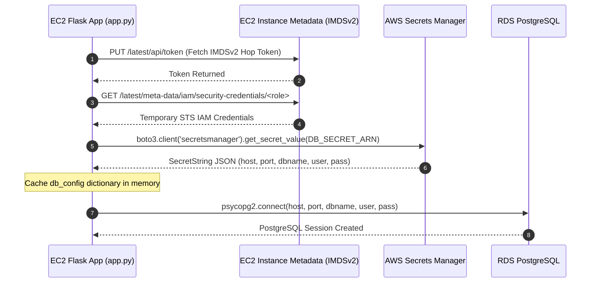

# 06. Database & Secrets Management — Comprehensive Notes

## 1. Overview

Database state for the EC2 task application is managed by Amazon RDS PostgreSQL (`terraform/modules/rds`). Credentials are not hardcoded in code or configuration files; instead, they are generated securely by Terraform and managed via AWS Secrets Manager.

---

## 2. RDS PostgreSQL Instance Configuration (`terraform/modules/rds/main.tf`)

```hcl
# Random Password Generation
resource "random_password" "master" {
  length           = 24
  special          = true
  override_special = "!#$%&*()-_=+[]{}<>:?"
}

# DB Subnet Group across isolated database subnets
resource "aws_db_subnet_group" "main" {
  name        = "${var.name_prefix}-db-subnet-group"
  subnet_ids  = var.database_subnet_ids
  description = "Database subnet group for RDS PostgreSQL instance"
}

# Private RDS PostgreSQL Instance
resource "aws_db_instance" "main" {
  identifier             = "${var.name_prefix}-rds"
  engine                 = "postgres"
  engine_version         = var.engine_version
  instance_class         = var.instance_class # db.t4g.micro
  allocated_storage      = var.allocated_storage # 20 GB
  max_allocated_storage  = 50
  storage_type           = "gp3"
  storage_encrypted      = true
  publicly_accessible    = false
  db_subnet_group_name   = aws_db_subnet_group.main.name
  vpc_security_group_ids = [aws_security_group.rds.id]

  db_name  = var.db_name # appdb
  username = var.db_username # dbadmin
  password = random_password.master.result
  port     = 5432

  backup_retention_period     = 1
  backup_window               = "03:00-04:00"
  maintenance_window          = "Mon:04:00-Mon:05:00"
  auto_minor_version_upgrade  = true
  allow_major_version_upgrade = false
  skip_final_snapshot         = true
  deletion_protection         = false
}
```

---

## 3. AWS Secrets Manager Integration

```hcl
# Secrets Manager Secret Container
resource "aws_secretsmanager_secret" "db_credentials" {
  name                    = "${var.name_prefix}-db-credentials"
  description             = "Database credentials for RDS PostgreSQL instance"
  recovery_window_in_days = 0
}

# Secret Version Payload
resource "aws_secretsmanager_secret_version" "db_credentials" {
  secret_id = aws_secretsmanager_secret.db_credentials.id
  secret_string = jsonencode({
    engine   = "postgres"
    host     = aws_db_instance.main.address
    port     = aws_db_instance.main.port
    dbname   = var.db_name
    username = var.db_username
    password = random_password.master.result
  })
}
```

---

## 4. EC2 IAM Read Policy for Secrets Manager

To allow the EC2 application to fetch the secret ARN without storing master access keys, an inline policy is attached to the EC2 instance SSM IAM role (`terraform/modules/ec2/main.tf`):

```hcl
resource "aws_iam_role_policy" "read_db_secret" {
  count = var.enable_db_secret_access ? 1 : 0
  name  = "${var.name_prefix}-read-db-secret"
  role  = aws_iam_role.ssm.id

  policy = jsonencode({
    Version = "2012-10-17"
    Statement = [
      {
        Effect   = "Allow"
        Action   = ["secretsmanager:GetSecretValue"]
        Resource = [var.db_secret_arn]
      }
    ]
  })
}
```

---

## 5. Sequence Diagram: Dynamic Credential Retrieval


