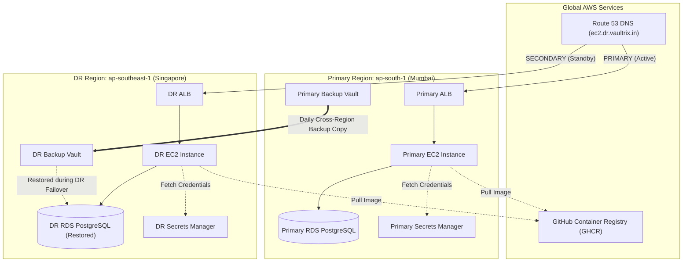

# 08. Multi-Region DR Architecture — Comprehensive Notes

## 1. Strategy Classification

As defined in [`docs/dr-strategy.md`](file:///c:/Users/smine/Disaster-Recovery/docs/dr-strategy.md), the Disaster Recovery architecture is classified as **Cross-Region Backup-and-Restore with Pilot-Light Standby Networking**.

- **Primary Region (`ap-south-1` / Mumbai)**: Active production region serving 100% of live traffic.
- **DR Region (`ap-southeast-1` / Singapore)**: Pre-warmed pilot-light standby environment. The VPC, public subnets, EC2 private subnets, database subnets, ALB, EC2 compute baseline, and RDS baseline are provisioned in advance by Terraform (`terraform/environments/dr/ec2`).

```
+---------------------------------------------------------------------------------------------------+
| RESOURCE RESPONSIBILITY MATRIX                                                                    |
+---------------------+---------------+-------------------+--------------------+--------------------+
| Component           | Primary       | DR                | Scope / Purpose    | Participation      |
+---------------------+---------------+-------------------+--------------------+--------------------+
| GHCR                | Shared        | Shared            | Container Registry | Immutable Images   |
| EC2 Instance        | Active (24/7) | Standby (Pilot)   | Application Host   | Runs Systemd/Docker|
| ALB                 | Active (24/7) | Standby (Pilot)   | Traffic Ingress    | Routes HTTP Port 80|
| RDS PostgreSQL      | Active (24/7) | Standby / Restored| Task Database      | Stores CRUD State  |
| AWS Secrets Manager | Active        | Active            | Credentials Safe   | Dynamic Auth       |
| Route 53            | Global        | Global            | DNS Router         | Failover Policy    |
| AWS Backup Vault    | Active        | Active            | Snapshot Storage   | Cross-Region Copy  |
| AWS SSM             | Active        | Active            | Remote Access      | Keyless Management |
+---------------------+---------------+-------------------+--------------------+--------------------+
```

---

## 2. Parameter Differences Between Environments

### Environment Variables Matrix (`locals.tf`)

| Configuration Parameter | Primary Environment (`ap-south-1`) | DR Environment (`ap-southeast-1`) |
| :--- | :--- | :--- |
| `name_prefix` | `vaultrix-dr-primary-ec2` | `vaultrix-dr-dr-ec2` |
| `app_env` | `PRIMARY` | `DR` |
| `aws_region` | `ap-south-1` | `ap-southeast-1` |
| `backup_retention_days` | `30` | `1` (Temporary drill retention) |
| `copy_action_destination_vault_arn` | Set to DR Vault ARN in `ap-southeast-1` | `null` (No outbound copy) |
| Route 53 Failover Policy | `PRIMARY` | `SECONDARY` |

---

## 3. High-Level Multi-Region Topology


