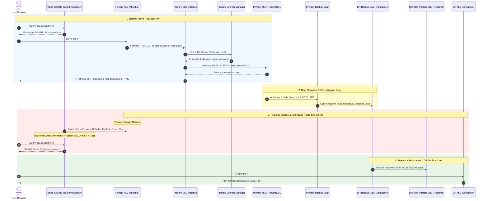

# 12. Complete End-to-End Master Flow & Developer Mental Model — Comprehensive Notes

## 1. The 5-Layer Developer Mental Model

To understand how the VaultRix EC2 Application and its Disaster Recovery architecture function, think of the system in five interacting layers:

```
  Layer 1: Code        --> GitHub Repository (applications/ec2-app/)
  Layer 2: Artifact    --> GitHub Container Registry (ghcr.io image)
  Layer 3: Infra       --> Terraform Modules & State Roots (VPC, Subnets, SG, IAM)
  Layer 4: Runtime     --> ALB + EC2 + Systemd + Docker + Flask + RDS PostgreSQL
  Layer 5: Resilience  --> Route 53 + AWS Backup + DR Standby + Failover Runbooks
```

---

## 2. End-to-End Master Sequence Diagram



---

## 3. "One Request, One Disaster" Teaching Scenarios

### Scenario 1: Container Process Crash
- **What happens**: Gunicorn or Flask crashes inside the Docker container.
- **Systemd Behavior**: `vaultrix-app.service` configured with `Restart=always` and `RestartSec=10` automatically restarts the Docker container within 10 seconds.
- **ALB Behavior**: ALB temporarily routes traffic to backup worker threads. **Route 53 failover is NOT triggered**.

### Scenario 2: EC2 Instance Failure
- **What happens**: The underlying EC2 VM crashes or experiences a hardware fault.
- **ALB Behavior**: ALB Target Group health check fails.
- **Route 53 Behavior**: Route 53 health check probes fail 3 consecutive times (~90 seconds total).
- **Outcome**: Route 53 automatically switches DNS resolution for `ec2.dr.vaultrix.in` to the DR ALB in Singapore.

### Scenario 3: Complete Primary Region Outage (Mumbai Down)
- **What happens**: Complete loss of Availability Zones in `ap-south-1`.
- **Automatic Action**: Route 53 automatically switches DNS traffic to the pre-warmed DR ALB in Singapore.
- **Operator Action**: Operator runs `aws backup start-restore-job` in `ap-southeast-1` to restore the daily PostgreSQL snapshot, updates the DR Secrets Manager secret, and restarts `vaultrix-app.service` via SSM.
- **Outcome**: Application becomes fully operational in Singapore with historical data intact up to the last daily snapshot.
