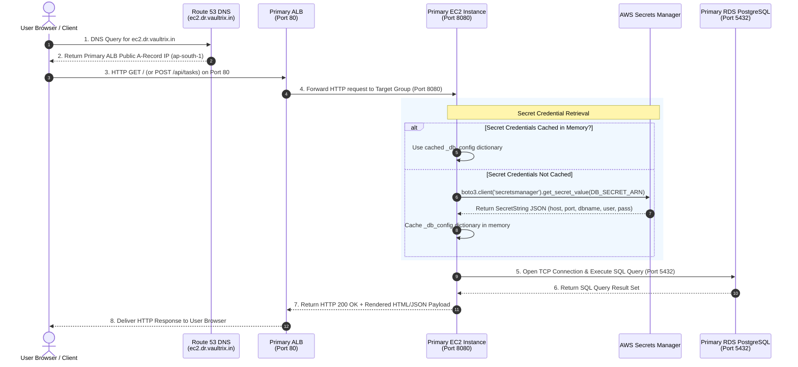
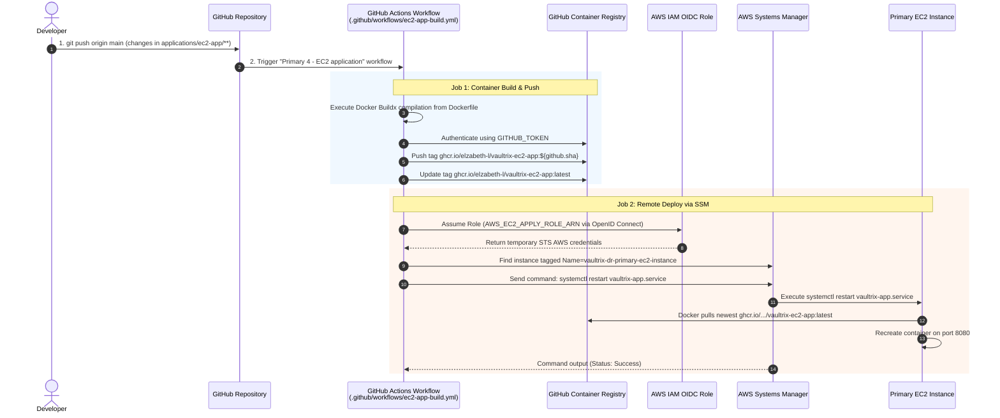
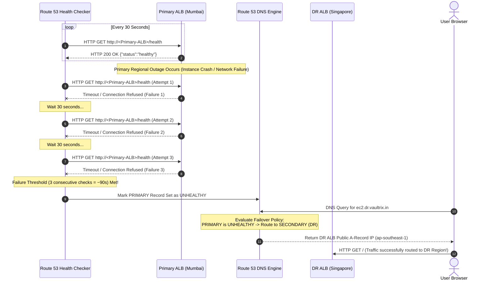
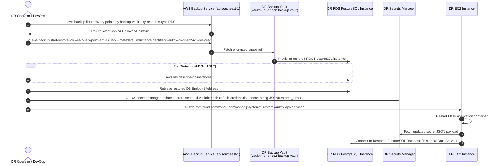
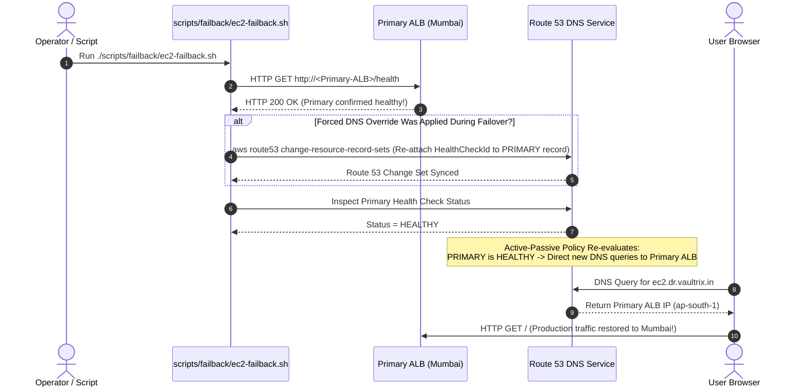

# VaultRix EC2 Application & Disaster Recovery Architectural Guide

Welcome to the comprehensive developer learning guide for the **VaultRix EC2 Application** and its **Disaster Recovery (DR) Architecture**.

This guide explains the complete internal working, infrastructure dependencies, runtime behaviors, backup mechanisms, workflow files, and failover/failback mechanisms implemented in this repository.

---

## 1. Master System Sequence Diagrams

### Sequence Diagram 1: Active Production Request Processing Flow

This sequence shows how a user HTTP request is routed and processed during normal production operations when the Primary region (`ap-south-1`) is active and healthy.



---

### Sequence Diagram 2: Continuous Integration & Remote Deployment Pipeline

This sequence illustrates what happens when a developer pushes new application code to `applications/ec2-app/**`.



---

### Sequence Diagram 3: Automated Route 53 Health Check Failover

This sequence details how Route 53 automatically detects a failure in Mumbai (`ap-south-1`) and switches DNS routing to Singapore (`ap-southeast-1`).



---

### Sequence Diagram 4: DR Database Snapshot Restoration Sequence

This sequence details how historical database state is restored in the DR region from the daily cross-region AWS Backup copy.



---

### Sequence Diagram 5: Recovery & Failback Sequence to Primary Region

This sequence details how production traffic is safely returned to Mumbai after primary region stability has been restored.



---

## 2. Resource Responsibility Matrix

```
+---------------------------------------------------------------------------------------------------+
| RESOURCE RESPONSIBILITY MATRIX                                                                    |
+---------------------+---------------+-------------------+--------------------+--------------------+
| Component           | Primary       | DR                | Scope / Purpose    | Participation      |
+---------------------+---------------+-------------------+--------------------+--------------------+
| GHCR                | Shared        | Shared            | Container Registry | Immutable Images   |
| EC2 Instance        | Active (24/7) | Standby (Pilot)   | Application Host   | Runs Systemd/Docker|
| ALB                 | Active (24/7) | Standby (Pilot)   | Traffic Ingress    | Routes HTTP Port 80|
| RDS PostgreSQL      | Active (24/7) | Standby / Restored| Task Database      | Stores CRUD State  |
| AWS Secrets Manager | Active        | Active            | Credentials Safe   | Dynamic Auth       |
| Route 53            | Global        | Global            | DNS Router         | Failover Policy    |
| AWS Backup Vault    | Active        | Active            | Snapshot Storage   | Cross-Region Copy  |
| AWS SSM             | Active        | Active            | Remote Access      | Keyless Management |
+---------------------+---------------+-------------------+--------------------+--------------------+
```

---

## 3. Guide Index & Document Series

| Document | Title | Focus Area |
| :--- | :--- | :--- |
| [01-application-architecture.md](file:///c:/Users/smine/Disaster-Recovery/docs/ec2/01-application-architecture.md) | Application Architecture | Core Flask application structure, Gunicorn process model, endpoints, dynamic environment badges |
| [02-build-and-ghcr-workflow.md](file:///c:/Users/smine/Disaster-Recovery/docs/ec2/02-build-and-ghcr-workflow.md) | Build & Image Pipeline | Docker container build, multi-stage optimization, GHCR publishing, GitHub Actions build workflow |
| [03-infrastructure-provisioning.md](file:///c:/Users/smine/Disaster-Recovery/docs/ec2/03-infrastructure-provisioning.md) | Infrastructure Provisioning | Terraform state hierarchy (`global`, `shared`, `ec2`), module dependencies, remote backend configuration |
| [04-ec2-runtime.md](file:///c:/Users/smine/Disaster-Recovery/docs/ec2/04-ec2-runtime.md) | EC2 Runtime & Bootstrap | Amazon Linux 2023 bootstrap, `user_data.sh.tftpl`, Systemd service `vaultrix-app.service`, keyless SSM access |
| [05-alb-and-network-flow.md](file:///c:/Users/smine/Disaster-Recovery/docs/ec2/05-alb-and-network-flow.md) | ALB & Network Traffic Flow | Ingress networking, security group chains (`ALB SG -> EC2 SG -> RDS SG`), health checks on `/health` |
| [06-rds-and-secrets.md](file:///c:/Users/smine/Disaster-Recovery/docs/ec2/06-rds-and-secrets.md) | Database & Secrets Management | RDS PostgreSQL configuration, AWS Secrets Manager credential JSON, lazy in-memory credential caching |
| [07-backup-and-recovery.md](file:///c:/Users/smine/Disaster-Recovery/docs/ec2/07-backup-and-recovery.md) | AWS Backup & Data Protection | AWS Backup daily schedule (`cron(0 2 * * ? *)`), retention policies, dynamic cross-region copy rules |
| [08-dr-architecture.md](file:///c:/Users/smine/Disaster-Recovery/docs/ec2/08-dr-architecture.md) | Multi-Region DR Architecture | Primary (`ap-south-1`) vs DR (`ap-southeast-1`), pilot-light standby configuration, resource responsibility matrix |
| [09-dr-failover.md](file:///c:/Users/smine/Disaster-Recovery/docs/ec2/09-dr-failover.md) | DR Detection & Failover Mechanics | Route 53 Active-Passive failover routing policy, health probes, automated CLI failover, forced DNS override |
| [10-dr-drill.md](file:///c:/Users/smine/Disaster-Recovery/docs/ec2/10-dr-drill.md) | Disaster Recovery Drill Workflow | Interactive GitHub Actions workflow (`dr-drill.yml`), task data snapshot seeding, pre-failover verification |
| [11-failback.md](file:///c:/Users/smine/Disaster-Recovery/docs/ec2/11-failback.md) | Failback Mechanics & Data Sync | Primary health restoration, DNS record re-association (`ec2-failback.sh`), data reconciliation considerations |
| [12-complete-ec2-dr-flow.md](file:///c:/Users/smine/Disaster-Recovery/docs/ec2/12-complete-ec2-dr-flow.md) | Complete End-to-End Master Flow | End-to-end master sequence diagrams, 5-layer mental model, "One Request, One Disaster" scenario walkthrough |
| [13-github-actions-workflows-deep-dive.md](file:///c:/Users/smine/Disaster-Recovery/docs/ec2/13-github-actions-workflows-deep-dive.md) | GitHub Actions Workflows Deep Dive | Comprehensive analysis of `ec2-app-build.yml`, `ec2-platform.yml`, `dr-platform.yml`, `dr-drill.yml`, and `terraform-pr.yml` |
