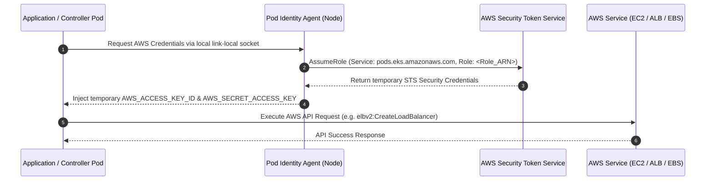

# 02. EKS IAM & Security Architecture — Technical Notes

## 1. Security Overview & IAM Layering

EKS security strictly separates cluster-level management permissions, worker node infrastructure permissions, and pod-level service account permissions.

```
+---------------------------------------------------------------------------------------------------+
| EKS IAM PERMISSION LAYERS                                                                         |
+--------------------------+----------------------------------+-------------------------------------+
| Layer                    | IAM Principal                    | AWS Managed Policies Attached       |
+--------------------------+----------------------------------+-------------------------------------+
| EKS Control Plane        | aws_iam_role.cluster             | AmazonEKSClusterPolicy              |
| Worker Nodes             | aws_iam_role.nodes               | AmazonEKSWorkerNodePolicy           |
|                          |                                  | AmazonEKS_CNI_Policy                |
|                          |                                  | AmazonEC2ContainerRegistryPullOnly  |
| Pod Identity: VPC CNI    | aws_iam_role.vpc_cni             | AmazonEKS_CNI_Policy                |
| Pod Identity: EBS CSI    | aws_iam_role.ebs_csi             | AmazonEBSCSIDriverPolicy            |
| Pod Identity: ALB Ctrl   | aws_iam_role.load_balancer_ctrl  | Inline ALB Controller Policy        |
+--------------------------+----------------------------------+-------------------------------------+
```

---

## 2. EKS Access Entries (API Authentication Mode)

The cluster uses EKS Access Entries (`authentication_mode = "API"`). Legacy `aws-auth` ConfigMaps are **not used**.

```hcl
# Grant GitHub Actions deployment role ClusterAdmin access
resource "aws_eks_access_entry" "github_apply" {
  cluster_name  = aws_eks_cluster.this.name
  principal_arn = var.github_apply_role_arn
  type          = "STANDARD"
}

resource "aws_eks_access_policy_association" "github_apply" {
  cluster_name  = aws_eks_cluster.this.name
  principal_arn = var.github_apply_role_arn
  policy_arn    = "arn:aws:eks::aws:cluster-access-policy/AmazonEKSClusterAdminPolicy"

  access_scope { type = "cluster" }
}

# Grant Human Operator user ClusterAdmin access
resource "aws_eks_access_entry" "eks_operator" {
  cluster_name  = aws_eks_cluster.this.name
  principal_arn = "arn:aws:iam::598120810297:user/vaultrix-dr-eks-operator"
  type          = "STANDARD"
}
```

---

## 3. EKS Pod Identity Associations

Instead of classic IRSA (IAM Roles for Service Accounts) which required managing OIDC provider URLs and IAM trust condition annotations, this project uses **AWS EKS Pod Identity**.

### How EKS Pod Identity Works:
1. `eks-pod-identity-agent` daemonset runs on every worker node.
2. IAM role trusts principal service `pods.eks.amazonaws.com`.
3. `aws_eks_pod_identity_association` binds the IAM role directly to a Kubernetes ServiceAccount in a target namespace.

```hcl
# IAM Trust Policy for Pod Identity
data "aws_iam_policy_document" "pods_assume_role" {
  statement {
    actions = ["sts:AssumeRole", "sts:TagSession"]
    principals {
      type        = "Service"
      identifiers = ["pods.eks.amazonaws.com"]
    }
  }
}

# Bind AWS Load Balancer Controller IAM Role to ServiceAccount in kube-system
resource "aws_eks_pod_identity_association" "load_balancer_controller" {
  cluster_name    = aws_eks_cluster.this.name
  namespace       = "kube-system"
  service_account = "aws-load-balancer-controller"
  role_arn        = aws_iam_role.load_balancer_controller.arn
}
```

---

## 4. Sequence Diagram: Pod Identity Credential Flow


