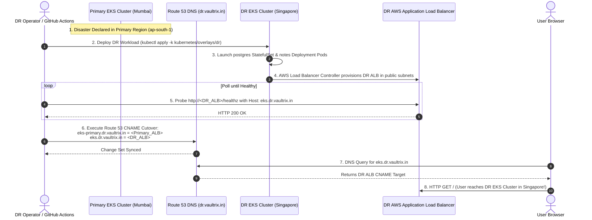

# 09. EKS Disaster Recovery Mechanics — Technical Notes

## 1. Overview & Strategy Classification

The EKS Disaster Recovery architecture is classified as **Multi-Region Pilot-Light Recovery with CNAME Traffic Cutover**.

Unlike EC2 which can be stopped and started on demand, an **Amazon EKS Control Plane cannot be stopped or paused**. Therefore, the DR region (`ap-southeast-1`) maintains a permanently deployed, baseline EKS cluster (`vaultrix-dr-dr-eks`) ready to receive workloads.

```
+---------------------------------------------------------------------------------------------------+
| REGIONAL EKS DISASTER RECOVERY COMPARISON                                                         |
+--------------------------+----------------------------------+-------------------------------------+
| Characteristic           | Primary Region (ap-south-1)      | DR Region (ap-southeast-1)          |
+--------------------------+----------------------------------+-------------------------------------+
| EKS Cluster Name         | vaultrix-dr-primary-eks          | vaultrix-dr-dr-eks                  |
| Node Capacity            | 2 x t4g.medium (AL2023 ARM64)    | 2 x t4g.small (AL2023 ARM64)        |
| Ingress Hostname         | eks.dr.vaultrix.in               | eks-dr.dr.vaultrix.in (Diagnostic)  |
| PostgreSQL Database      | StatefulSet (8Gi gp3 EBS Volume) | StatefulSet (Seeded during Drill)   |
| Route 53 Cutover Mode    | CNAME Alias to Primary ALB       | CNAME Alias updated to DR ALB       |
+--------------------------+----------------------------------+-------------------------------------+
```

---

## 2. Automatic vs. Manual Responsibilities Matrix

```
+---------------------------------------------------------------------------------------------------+
| EKS DISASTER RECOVERY RESPONSIBILITY TRUTH TABLE                                                  |
+--------------------------+--------------------+---------------------------------------------------+
| Event / Operation        | Automatic / Manual | Technical Enforcing Mechanism                     |
+--------------------------+--------------------+---------------------------------------------------+
| Application Pod Failure  | Automatic          | K8s Deployment ReplicaSet replacement + probes    |
| Worker Node Failure      | Automatic          | EKS Managed Node Group auto-scaling replacement   |
| Database Pod Failure     | Automatic          | StatefulSet volume re-attachment on new node      |
| Regional Outage Detect   | Manual / Pipeline  | Human operator or workflow dispatch trigger       |
| DR Workload Deployment   | Manual / Pipeline  | Workflow .github/workflows/dr-drill.yml           |
| Data Snapshot Seeding    | Manual / Pipeline  | API Task/Notes JSON capture & restore in DR       |
| Route 53 Traffic Cutover | Manual / Pipeline  | AWS CLI route53 change-resource-record-sets CNAME |
| Failback to Primary      | Manual / Pipeline  | Workflow operation 'Failback to primary'          |
+--------------------------+--------------------+---------------------------------------------------+
```

---

## 3. Sequence Diagram: Primary EKS Regional Failover


