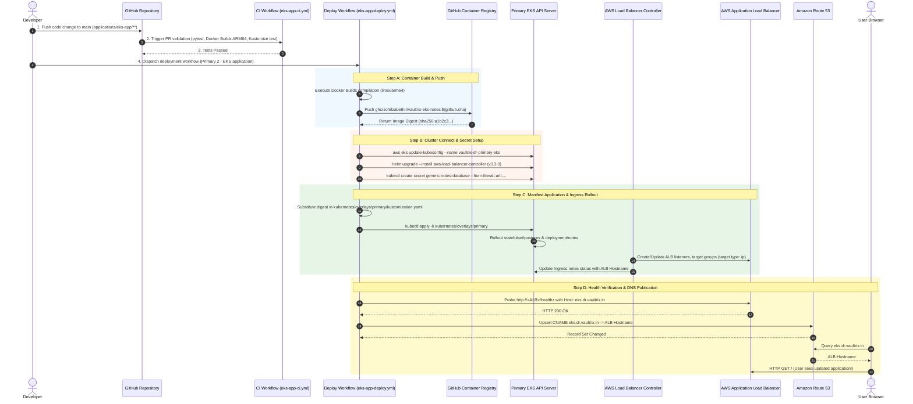

# 11. Complete End-to-End Pipeline Flow — Technical Notes

## 1. Complete End-to-End Application Lifecycle

The following sequence details the complete path of an application change from developer commit to Kubernetes pod execution and Route 53 DNS publication.

