# VaultRix EKS Application & Disaster Recovery Architecture Guide

Welcome to the master developer guide for the **VaultRix EKS (Elastic Kubernetes Service) Application** and its multi-region **Disaster Recovery (DR) Architecture**.

This documentation series explains the complete technical architecture, infrastructure definitions, Kubernetes manifests, container image build pipelines, GitHub Actions workflows, IRSA/Pod Identity security models, ingress network flows, data protection mechanisms, DR cutover strategies, and failback runbooks.

---

## 1. High-Level EKS End-to-End Architecture

```mermaid
flowchart TD
    subgraph Clients["Clients & Operations"]
        UserClient["User Browser / Client API"]
        GHActions["GitHub Actions CI/CD Workflows"]
        EKSOperator["EKS Cluster Operator (kubectl / Helm)"]
    end

    subgraph GlobalServices["Global AWS Services"]
        R53["Amazon Route 53 DNS<br/>FQDN: eks.dr.vaultrix.in<br/>(CNAME Routing)"]
        GHCR["GitHub Container Registry (GHCR)<br/>ghcr.io/elzabeth-l/vaultrix-eks-notes:<sha>"]
    end

    subgraph PrimaryRegion["Primary Region: ap-south-1 (Mumbai)"]
        subgraph PrimaryVPC["Primary VPC (10.10.0.0/16)"]
            PriPublicSubnets["Public Subnets"]
            PriPrivSubnets["Private EKS Subnets (10.10.2.0/24, 10.10.12.0/24)"]
            
            PriALB["AWS Application Load Balancer<br/>(Managed by AWS Load Balancer Controller)"]
            
            subgraph PrimaryCluster["Primary EKS Cluster: vaultrix-dr-primary-eks"]
                PriControlPlane["EKS Control Plane v1.32<br/>(Managed K8s API)"]
                PriNodes["Managed Node Group (ARM64 / AL2023)<br/>2 x t4g.medium Nodes"]
                
                subgraph PriNamespace["Namespace: notes"]
                    PriAppDeploy["Deployment: notes (2 Replicas)<br/>Pod Security: Non-Root (UID 10001)"]
                    PriAppSVC["Service: notes (ClusterIP Port 80)"]
                    PriIngress["Ingress: notes (ALB Class)"]
                    PriPDB["PodDisruptionBudget: minAvailable 1"]
                    PriPGSet["StatefulSet: postgres (1 Replica)<br/>Image: postgres:17.6-alpine"]
                    PriPGSVC["Headless Service: postgres (ClusterIP None)"]
                    PriPVC["PersistentVolumeClaim: data (8Gi gp3)"]
                    PriSecret["Kubernetes Secret: notes-database"]
                end

                PriLBC["AWS Load Balancer Controller v3.3.0<br/>(kube-system)"]
                PriCSI["AWS EBS CSI Driver<br/>(kube-system)"]
            end

            PriSM["AWS Secrets Manager<br/>vaultrix-dr-primary-eks/notes/database"]
        end
    end

    subgraph DRRegion["Disaster Recovery Region: ap-southeast-1 (Singapore)"]
        subgraph DRVPC["DR VPC (10.20.0.0/16)"]
            DRPublicSubnets["Public Subnets"]
            DRPrivSubnets["Private EKS Subnets"]
            
            DRALB["DR AWS Application Load Balancer"]
            
            subgraph DRCluster["DR EKS Cluster: vaultrix-dr-dr-eks"]
                DRControlPlane["DR EKS Control Plane v1.32"]
                DRNodes["DR Managed Node Group (ARM64)<br/>2 x t4g.small Nodes"]
                
                subgraph DRNamespace["Namespace: notes"]
                    DRAppDeploy["Deployment: notes (2 Replicas)"]
                    DRAppSVC["Service: notes"]
                    DRIngress["Ingress: notes (ALB Class)"]
                    DRPGSet["StatefulSet: postgres (1 Replica)"]
                    DRSecret["Kubernetes Secret: notes-database"]
                end

                DRLBC["AWS Load Balancer Controller v3.3.0"]
            end

            DRSM["AWS Secrets Manager<br/>vaultrix-dr-dr-eks/notes/database"]
        end
    end

    %% Client and Routing
    UserClient --> R53
    R53 -- "CNAME -> Primary ALB" --> PriALB
    R53 -. "Failover CNAME -> DR ALB" .-> DRALB

    %% Primary Traffic Path
    PriALB --> PriIngress
    PriIngress --> PriAppSVC
    PriAppSVC --> PriAppDeploy
    PriAppDeploy --> PriPGSVC
    PriPGSVC --> PriPGSet
    PriPGSet --> PriPVC

    %% DR Traffic Path
    DRALB --> DRIngress
    DRIngress --> DRAppSVC
    DRAppSVC --> DRAppDeploy
    DRAppDeploy --> DRPGSet

    %% Deployment & Auth Flow
    GHActions ==> GHCR
    GHActions ==> PriControlPlane
    GHActions ==> DRControlPlane
    PriAppDeploy -. "Pulls Image" .-> GHCR
    DRAppDeploy -. "Pulls Image" .-> GHCR
    GHActions -. "Fetches/Populates Password" .-> PriSM
    GHActions -. "Fetches/Populates Password" .-> DRSM

    %% Operator Connections
    EKSOperator ==> PriControlPlane
    EKSOperator ==> DRControlPlane
```



---

## 2. Resource Responsibility & Environment Matrix

```
+---------------------------------------------------------------------------------------------------+
| EKS RESOURCE RESPONSIBILITY MATRIX                                                                |
+---------------------+---------------+-------------------+--------------------+--------------------+
| Component           | Primary       | DR                | Scope / Purpose    | Participation      |
+---------------------+---------------+-------------------+--------------------+--------------------+
| GHCR                | Shared        | Shared            | Container Registry | Immutable Images   |
| EKS Cluster         | Active (24/7) | Standby (Pilot)   | Kubernetes Engine  | v1.32 Control Plane|
| Node Group          | 2 x t4g.medium| 2 x t4g.small     | Worker Capacity    | AL2023 ARM64 Nodes |
| AWS Load Balancer   | Active (24/7) | Standby (Pilot)   | Ingress Routing    | Managed by AWS LBC |
| PostgreSQL          | StatefulSet   | StatefulSet       | Notes Database     | Encrypted 8Gi gp3  |
| AWS Secrets Manager | Active        | Active            | Credentials Safe   | Secrets Store      |
| Route 53            | Global        | Global            | DNS Router         | CNAME Record       |
+---------------------+---------------+-------------------+--------------------+--------------------+
```

---

## 3. Guide Index & Document Series

| Document | Title | Focus Area |
| :--- | :--- | :--- |
| [01-eks-infrastructure.md](file:///c:/Users/smine/Disaster-Recovery/docs/eks/01-eks-infrastructure.md) | EKS Infrastructure Provisioning | Terraform EKS platform module, VPC subnets, control plane logging, node groups |
| [02-eks-iam-and-security.md](file:///c:/Users/smine/Disaster-Recovery/docs/eks/02-eks-iam-and-security.md) | EKS IAM & Security Architecture | EKS cluster role, Node role, EKS Access Entries, Pod Identity associations (VPC CNI, EBS CSI, LBC) |
| [03-application-deployment.md](file:///c:/Users/smine/Disaster-Recovery/docs/eks/03-application-deployment.md) | Application Deployment & Kustomize | Kustomize base & overlays, image tag substitution (`replace-me` -> SHA/digest), deployment workflow |
| [04-github-actions.md](file:///c:/Users/smine/Disaster-Recovery/docs/eks/04-github-actions.md) | GitHub Actions CI/CD Deep Dive | Detailed breakdown of `eks-app-ci.yml`, `eks-app-deploy.yml`, `eks-platform.yml`, `dr-platform.yml` |
| [05-argocd-gitops.md](file:///c:/Users/smine/Disaster-Recovery/docs/eks/05-argocd-gitops.md) | Deployment & GitOps Model | Kustomize manifest reconciliation model, image immutability, state sync verification |
| [06-kubernetes-application.md](file:///c:/Users/smine/Disaster-Recovery/docs/eks/06-kubernetes-application.md) | Kubernetes Manifest Specifications | Namespace, Deployment, StatefulSet, Headless Service, Ingress, PodDisruptionBudget, StorageClass |
| [07-network-flow.md](file:///c:/Users/smine/Disaster-Recovery/docs/eks/07-network-flow.md) | Network Flow & AWS Load Balancer Controller | Route 53 CNAME $\to$ ALB $\to$ Ingress $\to$ Service $\to$ Pod $\to$ Headless Service $\to$ PostgreSQL StatefulSet |
| [08-data-layer.md](file:///c:/Users/smine/Disaster-Recovery/docs/eks/08-data-layer.md) | Data Layer Architecture | PostgreSQL 17.6-alpine StatefulSet, PVC volume templates, Secrets Manager integration |
| [09-disaster-recovery.md](file:///c:/Users/smine/Disaster-Recovery/docs/eks/09-disaster-recovery.md) | EKS Disaster Recovery Mechanics | Multi-region pilot light EKS, Route 53 CNAME cutover, data snapshot seeding mechanics |
| [10-dr-drills.md](file:///c:/Users/smine/Disaster-Recovery/docs/eks/10-dr-drills.md) | EKS Disaster Recovery Drills | Inspection of `.github/workflows/dr-drill.yml` (`deploy-eks`, `cutover-eks`, `cleanup-eks`) |
| [11-complete-pipeline-flow.md](file:///c:/Users/smine/Disaster-Recovery/docs/eks/11-complete-pipeline-flow.md) | Complete End-to-End Pipeline Lifecycle | Master lifecycle from developer commit to Kubernetes rollout and Route 53 CNAME publication |
| [12-how-everything-connects.md](file:///c:/Users/smine/Disaster-Recovery/docs/eks/12-how-everything-connects.md) | Developer Story: How Everything Connects | Story-driven guide for developers: "What happens when I push code?", "What happens during a disaster?" |
| [13-resource-inventory.md](file:///c:/Users/smine/Disaster-Recovery/docs/eks/13-resource-inventory.md) | Complete Resource Inventory Table | Full table listing every AWS & Kubernetes resource, layer, namespace, region, and DR role |
| [14-debugging-and-observability.md](file:///c:/Users/smine/Disaster-Recovery/docs/eks/14-debugging-and-observability.md) | Debugging & Observability Manual | Hands-on `kubectl`, `helm`, and `aws` CLI diagnostic commands for troubleshooting EKS pods & ingress |
| [15-developer-learning-guide.md](file:///c:/Users/smine/Disaster-Recovery/docs/eks/15-developer-learning-guide.md) | Progressive Developer Learning Guide | 12-level structured learning pathway from EKS basics to advanced multi-region DR cutover |
